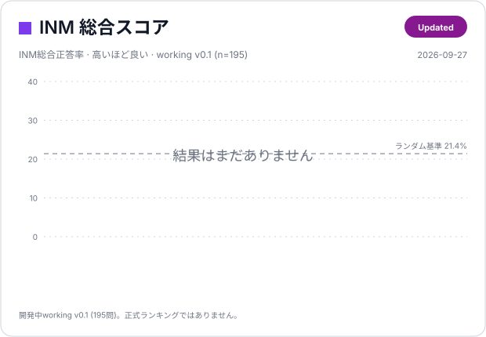
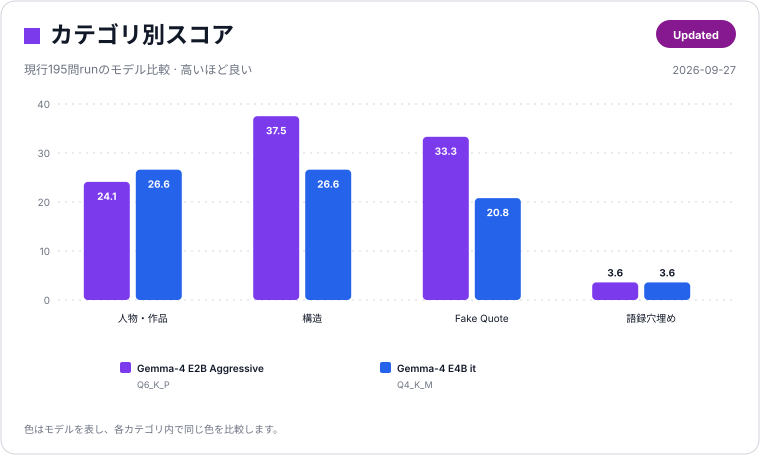

# INM スコアボード

INMで評価したモデルを、総合スコアとカテゴリ別スコアで視覚的に比較するためのページです。

[English](score.md) | 日本語

> **現在の状態:** INM v0.1 は作問・レビュー中です。現在のcanonical working setは **195問** です。正式ランキングには、固定されたbenchmark releaseを `Official / Isolated` 条件で評価し、raw resultまで監査可能な結果だけを掲載します。提出要件は [`results/README.md`](results/README.md) を参照してください。

## ビジュアルスコアボード





総合カードの破線は、現在の **195問working set** に対する概算ランダム基準です。4択167問を25%でランダム回答し、free-textのQuote Completion 28問を偶然正解0%とみなすと、全体では約 **21.4%** になります。これは開発中v0.1用の参考線であり、今後のINM versionすべてに共通する基準ではありません。

カードの元データは [`data/leaderboard.json`](data/leaderboard.json) です。

```bash
python scripts/render_scoreboard.py
```

を実行すると、英語版・日本語版のSVGカードを `docs/assets/` に再生成できます。

## 現行Development run

現在の標準System promptは [`prompts/system_v0.2.txt`](prompts/system_v0.2.txt) です。必要に応じて利用可能なreasoning / thinkingを使い、visible outputには最終回答だけを出すよう明示しています。

**現時点では `system_v0.2` で取得したDevelopment runはまだありません。** 195問working setで各modelを再実行した結果から、ここへ追加します。

そのため、ビジュアルカードも現行prompt revisionについてはいったん空表示です。旧結果は下の履歴欄に保持しています。

<details>
<summary><strong>過去のDevelopment run</strong></summary>

以下はすべて `system_v0.1` を使ったrunです。監査・開発履歴として残しますが、`system_v0.2` の結果と直接混ぜて比較しません。

| モデル | Overall | Macro | Character / Work | Structure | Fake Quote | Quote Completion | 正解 / n | Sampling | Dataset | Prompt | Run ID |
|---|---:|---:|---:|---:|---:|---:|---:|---|---|---|---|
| Gemma-4-E2B-Uncensored-HauhauCS-Aggressive | 26.7% | 24.6% | 24.1% | 37.5% | 33.3% | 3.6% | 52/195 | `temperature: 0.6` | working v0.1、195問 | `system_v0.1` | `20260927T061853Z_ollama-local_fe076f9f` |
| gemma-4-E4B-it-GGUF | 22.6% | 19.4% | 26.6% | 26.6% | 20.8% | 3.6% | 44/195 | `temperature: 0.6` | working v0.1、195問 | `system_v0.1` | `20260927T064320Z_ollama-local_6afaaadb` |
| Gemma-4-E2B-Uncensored-HauhauCS-Aggressive | 21.6% | 17.4% | 24.1% | 28.1% | — | 0.0% | 37/171 | `temperature: 0.6` | Batch04前、171問 | `system_v0.1` | `20260927T053604Z_ollama-local_fae79399` |
| Gemma-4-E2B-Uncensored-HauhauCS-Aggressive | 24.6% | 19.9% | 25.3% | 34.4% | — | 0.0% | 42/171 | `temperature: 0` 強制の旧設定 | Batch04前、171問 | `system_v0.1` | `20260927T051313Z_ollama-local_4ee79ea9` |

最後のrunは旧runnerが `temperature: 0` を強制していたため、モデルの代表性能としても無効化した結果です。最初の2runは現行195問datasetですが、reasoning-awareなv0.2より前のpromptを使っています。

</details>

## Official / Isolated Leaderboard

正式Leaderboardは、最初の **固定INM release** を公開した後に運用を開始します。それまでは、空の順位表を表示しない方針です。

Contributorから提出された結果は、少なくとも以下を満たす場合にOfficial掲載候補になります。

- 固定されたINM releaseまたはimmutable benchmark commitを使用している
- 1 itemごとに独立したrequestで評価している
- Web search、RAG、tools、MCP、external retrievalを使っていない
- 正確なmodel/versionとbackendが記録されている
- 該当する場合は量子化情報が記録されている
- reasoning / sampling overrideがある場合は明示されている
- item-level raw resultまたは同等に監査可能な証拠がある
- 非公開のmanual correctionやitem exclusionがない

条件を満たす結果が1件以上入った段階で、Official表を表示し、原則として **INM Overall** の降順で順位付けします。同じモデルでもreasoning、sampling、量子化、backendが実質的に異なる場合は別行として扱います。

結果提出は [`results/README.md`](results/README.md) の手順に従ってください。このスコアボードは表示用であり、提出・検証ルールはそちらを正式仕様とします。

## スコア指標

- **INM Overall** — 全得点対象itemに対するaccuracy。Leaderboardの主指標です。
- **INM Macro** — カテゴリごとのaccuracyを等重みで平均した値です。問題数の多いカテゴリだけが総合値を支配するのを防ぎます。
- **Character / Work** — 作品情報、出典、人物、alias、speakerなどの知識です。
- **Structure** — 人物関係、場面構造、pairing、ordering、compound knowledgeです。
- **Fake Quote** — 正規語録とsynthetic / attested fake memeの識別です。
- **Quote Completion** — 定着した語録の空欄をnormalized exact matchで評価します。
- **正解 / n** — raw correct countと得点対象item総数です。

## スコアボード更新方法

[`data/leaderboard.json`](data/leaderboard.json) にentryを追加・更新してから、

```bash
python scripts/render_scoreboard.py
```

を実行します。

生成されるファイル:

```text
docs/assets/scoreboard_overall.svg
docs/assets/scoreboard_overall_ja.svg
docs/assets/scoreboard_categories.svg
docs/assets/scoreboard_categories_ja.svg
```

完全な再現情報とitem-level raw resultは `results/` 以下で管理し、`data/leaderboard.json` は表示用のコンパクトなデータソースとして扱います。履歴entryは `archived: true`、`show_in_chart: false` として残します。
