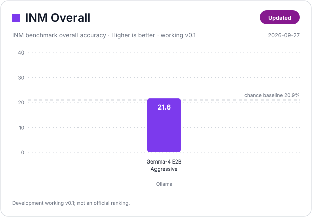
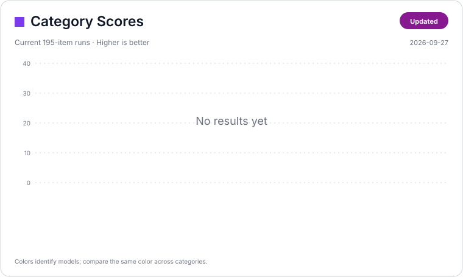

# INM Scoreboard

A compact visual leaderboard for comparing model performance on INM.

English | [日本語](score.ja.md)

> **Status:** INM v0.1 is still under authoring and review. The current canonical working set contains **195 items**. Official rankings should only use a frozen benchmark release and an auditable `Official / Isolated` run. Submission requirements live in [`results/README.md`](results/README.md).

## Visual scoreboard





The dashed line on the Overall card is the approximate random-answer baseline for the **current 195-item working set**: 167 four-choice items at 25% chance plus 28 free-text Quote Completion items, giving about **21.4% overall**. This is a development reference rather than a universal baseline for future INM versions.

The cards are generated from [`data/leaderboard.json`](data/leaderboard.json):

```bash
python scripts/render_scoreboard.py
```

This regenerates the English and Japanese SVG cards under `docs/assets/`.

## Current development runs

The current standard system prompt is [`prompts/system_v0.2.txt`](prompts/system_v0.2.txt), which explicitly tells models to use available reasoning/thinking when useful while emitting only the final answer.

**No current-prompt (`system_v0.2`) development runs have been added yet.** New runs will appear here as models are rerun on the 195-item working set.

The visual cards are therefore intentionally empty for the current prompt revision. Previous results are retained below for audit/history.

<details>
<summary><strong>Historical development runs</strong></summary>

These runs used `system_v0.1` and are retained for audit/history. They must not be mixed directly with `system_v0.2` results.

| Model | Overall | Macro | Character / Work | Structure | Fake Quote | Quote Completion | Correct / n | Sampling | Dataset | Prompt | Run ID |
|---|---:|---:|---:|---:|---:|---:|---:|---|---|---|---|
| Gemma-4-E2B-Uncensored-HauhauCS-Aggressive | 26.7% | 24.6% | 24.1% | 37.5% | 33.3% | 3.6% | 52/195 | `temperature: 0.6` | working v0.1, 195 items | `system_v0.1` | `20260927T061853Z_ollama-local_fe076f9f` |
| gemma-4-E4B-it-GGUF | 22.6% | 19.4% | 26.6% | 26.6% | 20.8% | 3.6% | 44/195 | `temperature: 0.6` | working v0.1, 195 items | `system_v0.1` | `20260927T064320Z_ollama-local_6afaaadb` |
| Gemma-4-E2B-Uncensored-HauhauCS-Aggressive | 21.6% | 17.4% | 24.1% | 28.1% | — | 0.0% | 37/171 | `temperature: 0.6` | pre-Batch04, 171 items | `system_v0.1` | `20260927T053604Z_ollama-local_fae79399` |
| Gemma-4-E2B-Uncensored-HauhauCS-Aggressive | 24.6% | 19.9% | 25.3% | 34.4% | — | 0.0% | 42/171 | `temperature: 0` legacy forced config | pre-Batch04, 171 items | `system_v0.1` | `20260927T051313Z_ollama-local_4ee79ea9` |

The last row is additionally invalidated as a representative model result because the old runner forced `temperature: 0`. The first two rows used the current 195-item dataset, but their system prompt predates the reasoning-aware v0.2 prompt.

</details>

## Official / Isolated Leaderboard

The official leaderboard will begin after the first **frozen INM release**. Until then, this page intentionally does not show an empty ranking table.

A contributed result can qualify for the official leaderboard when it uses:

- a frozen INM release or immutable benchmark commit;
- one isolated request per item;
- no web search, RAG, tools, MCP, or external retrieval;
- an exact model/version and backend record;
- quantization metadata when applicable;
- disclosed reasoning and sampling overrides when applicable;
- auditable item-level raw results or equivalent evidence;
- no undisclosed manual answer correction or item exclusion.

Once at least one qualifying result exists, official rows will be ranked primarily by **INM Overall**. Materially different reasoning, sampling, quantization, or backend configurations should be listed as separate rows.

Contributors can submit results using the process in [`results/README.md`](results/README.md). The scoreboard is only the presentation layer; that document remains the normative submission and verification policy.

## Score columns

- **INM Overall** — accuracy over all scored items. This is the primary leaderboard value.
- **INM Macro** — unweighted mean of category accuracies, preventing the largest category from dominating the summary.
- **Character / Work** — work metadata, source knowledge, entities, aliases, speakers, and related character knowledge.
- **Structure** — relationships, scene/work structure, pairing, ordering, and compound knowledge.
- **Fake Quote** — distinguishing legitimate target quotes from synthetic or attested fake-meme expressions.
- **Quote Completion** — normalized exact-match completion of established quote forms.
- **Correct / n** — raw correct count and total scored items.

## Scoreboard data workflow

Add or update an entry in [`data/leaderboard.json`](data/leaderboard.json), then run:

```bash
python scripts/render_scoreboard.py
```

Generated files:

```text
docs/assets/scoreboard_overall.svg
docs/assets/scoreboard_overall_ja.svg
docs/assets/scoreboard_categories.svg
docs/assets/scoreboard_categories_ja.svg
```

Keep full reproducibility metadata and raw item-level results in `results/`; `data/leaderboard.json` is only the compact presentation source. Historical entries remain in the JSON with `archived: true` and `show_in_chart: false`.
